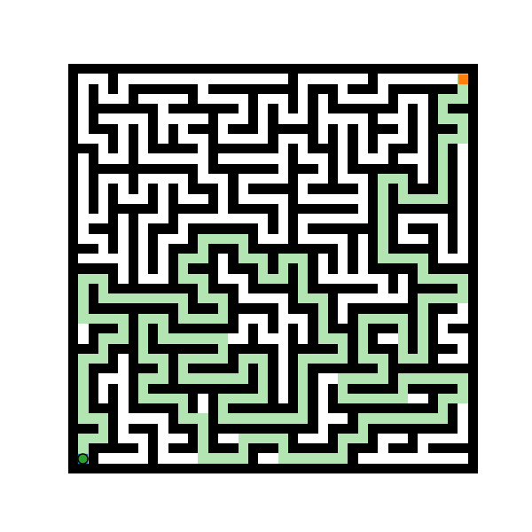

📘 **“Autonomous Robot Path Finder using Artificial Intelligence”**

---

# 🤖 Autonomous Robot Path Finder using Artificial Intelligence

An AI-based simulation project that demonstrates how an autonomous robot can intelligently find the optimal path from a start point to a goal while avoiding obstacles. The project uses the **A*** (A-Star) algorithm for efficient and heuristic-driven pathfinding in a 2D grid environment.

---

## 🧭 **Project Overview**

This mini-project aims to simulate a robot’s autonomous navigation behavior using Artificial Intelligence concepts.
The robot navigates through a grid-based environment, identifying the shortest collision-free route between a start and goal position.

**Key Features:**

* Implements **A*** Pathfinding Algorithm
* Visualizes grid, obstacles, and computed optimal path
* Demonstrates AI-based decision-making for navigation
* Easy to extend for real-world robotic systems

---

## 🧠 **Concepts Used**

* **Artificial Intelligence** for decision-making and optimization
* **Search Algorithms (A*)** for path planning
* **Heuristics (Manhattan Distance)** for goal estimation
* **Python & Matplotlib** for simulation and visualization

---

## ⚙️ **Algorithm Used – A* (A-Star) Algorithm**

The A* algorithm finds the shortest path using both the actual cost (`g(n)`) and estimated heuristic cost (`h(n)`):

[
f(n) = g(n) + h(n)
]

Where:

* `g(n)` = cost from start to current node
* `h(n)` = heuristic distance to goal (Manhattan distance)

A* ensures both **optimality** and **efficiency**, making it ideal for robot pathfinding.

---

## 💻 **Implementation**

### **Requirements**

Make sure you have the following installed:

```bash
python 3.x
matplotlib
numpy
```

Install dependencies:

```bash
pip install matplotlib numpy
```

### **Run the Project**

Clone the repository and run the script:

```bash
git clone https://github.com/<your-username>/Autonomous-Robot-Path-Finder.git
cd Autonomous-Robot-Path-Finder
python path_finder.py
```

---

## 🧩 **Code Structure**

```
Autonomous-Robot-Path-Finder/
│
├── path_finder.py           # Main Python code (A* implementation)
├── README.md                # Project documentation
├── output/                  # Output screenshots (optional)
└── report.pdf               # Detailed project report (optional)
```

---

## 📊 **Output Example**

The output displays:

* White cells → Free space
* Black cells → Obstacles
* Grey path → Optimal path generated by A*

Example:

| Grid Representation | Description               |
| ------------------- | ------------------------- |
| 🟩 Start Node       | Robot's starting point    |
| 🟥 Goal Node        | Target destination        |
| ⬛ Obstacles         | Blocked cells             |
| ⚪ Path              | Optimal path traced by A* |

### 🎥 **Demo Output**
Below is the simulation of the robot finding its path automatically using the A\* algorithm:



---

## 🧾 **Results**

* Successfully finds the shortest path avoiding obstacles.
* Demonstrates intelligent decision-making using AI search algorithms.
* Path visualization helps understand A* exploration and selection process.

---

## 🚀 **Future Enhancements**

* Dynamic obstacle detection and avoidance.
* Integration with **ROS (Robot Operating System)** for real robot control.
* 3D path planning for drones or multi-floor navigation.
* Real-time updates using **sensor data (LiDAR / Ultrasonic)**.

---

## 🧱 **Project Goals**

* To simulate intelligent robot pathfinding.
* To implement AI search algorithms for autonomous navigation.
* To visualize how A* efficiently computes optimal paths.

---

## 🔗 **GitHub Repository**

👉 [https://github.com/<your-username>/Autonomous-Robot-Path-Finder](#)

---

## 📚 **References**

1. Russell, S. & Norvig, P. *Artificial Intelligence: A Modern Approach*, Pearson.
2. LaValle, S. M. *Planning Algorithms*, Cambridge University Press.
3. Thrun, S., Burgard, W., & Fox, D. *Probabilistic Robotics*, MIT Press.
4. TutorialsPoint – *A* Search Algorithm Overview*.
5. Towards Data Science – *Understanding the A* Pathfinding Algorithm*.

---

## 👩‍💻 **Author**

**Name:** Shalini
**Institution:** [Your College Name]
**Course:** Artificial Intelligence Mini Project
**Year:** 2025

---

Would you like me to also create a **`report.pdf` template** version (formatted like a college mini-project submission with all sections — Aim, Algorithm, Code, Output, Results, etc.) for you to upload alongside the README?
